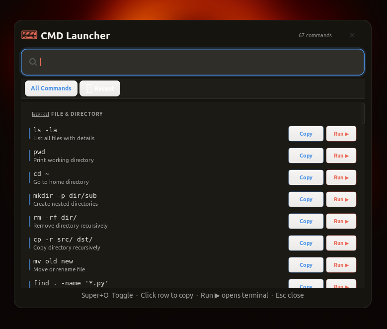

# cmd-launcher

A keyboard-driven command cheatsheet panel for Linux desktops.  
Press `Super + O` anywhere to bring up a searchable, dark-themed overlay of your personal command library — then dismiss it just as fast.

Built for the kind of workflow where reaching for the mouse is already too slow.


---

## Why

Terminal muscle memory has limits. I kept a text file of commands I use across ML experiments, git workflows, and system maintenance — and I kept forgetting where it was. This is the structured version of that file, with a global hotkey and fuzzy search.

---

## Features

- **Global toggle** — `Super + O` shows and hides the panel from any context
- **Fuzzy search** — filters commands in real-time as you type
- **One-click copy** — click any row to copy the command to clipboard
- **Fully local** — no network requests, no keylogging beyond the registered hotkey combo
- **JSON-driven config** — add, remove, or reorganize commands without touching the code

---

## Requirements

- Linux (X11 or Wayland via XWayland)
- Python 3.8+
- GTK 3

---

## Installation

```bash
git clone https://github.com/jhonReese/linux-cmd-launcher.git
cd linux-cmd-launcher
chmod +x install.sh
./install.sh
```

Then launch with:

```bash
cmd-launcher
```

The process runs in the background and listens for `Super + O`.

---

## Configuration

Edit `~/.local/share/cmd-launcher/config/commands.json` to define your command groups:

```json
{
  "name": "Git",
  "color": "#4A90E2",
  "commands": [
    { "cmd": "git log --oneline -10", "desc": "Recent commits" },
    { "cmd": "git stash pop",         "desc": "Restore stash" }
  ]
}
```

Each group takes a `name`, a `color` (used as the category accent), and a list of `{ cmd, desc }` entries.

---

## Uninstall

```bash
./uninstall.sh
```

---

## Privacy

- No API keys or credentials are stored anywhere
- Only the `Super + O` key combination is intercepted — no other keystrokes are logged or transmitted
- All data remains local

---

## Notes

Tested primarily on WSL2 with WSLg (XWayland). The UI uses Cairo for rendering to avoid compositing dependencies, which makes it stable in environments where a compositor is not guaranteed.

If the panel doesn't appear on first launch, check that `xdotool` and `python3-gi` are installed.
